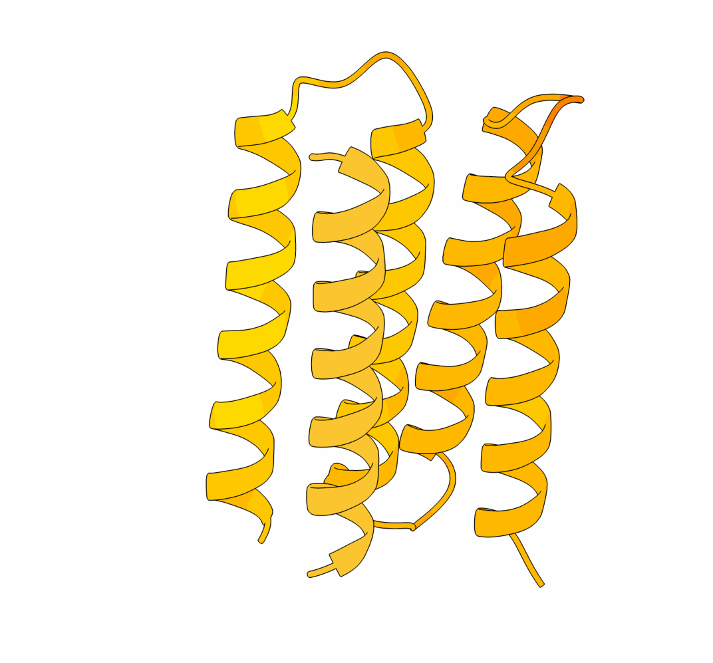

# De novo Design of Protein Cages to Facilitate Melittin Production

  

This repo is about script of using **SLIMshot** to design cage that facilitate Melittin production. 

**SLIMshot** is a protein design and validation pipeline focused on de novo sequence generation and structure-based filtering for targeted binders and complexes. It integrates a diffusion-based sequence generator with SE(3)-equivariant models, topology control, AlphaFold2-based complex validation, ProteinMPNN for redesign, and PyRosetta for structural filtering and relaxation. 

# Design Analysis

- `Melittin_cage_design_analysis.ipynb`: Jupyter notebook analyzing and visualizing cage designs.
  
# Folder Organization

- `final_binder_designs/`: Final filtered designs.
- `final_binder_designs_stats.csv`: Table with top designs and scores.
- `mpnn/`: Outputs from ProteinMPNN redesigns.
- `pyrosetta/`: Outputs from PyRosetta relaxation.
- `validation/`: AlphaFold2 and ColabDesign predictions.
- `trajectories/`: Generation logs and metadata.
- `figs/`: Plots and images from this run.
- `top_binders/`: Top design copies.
